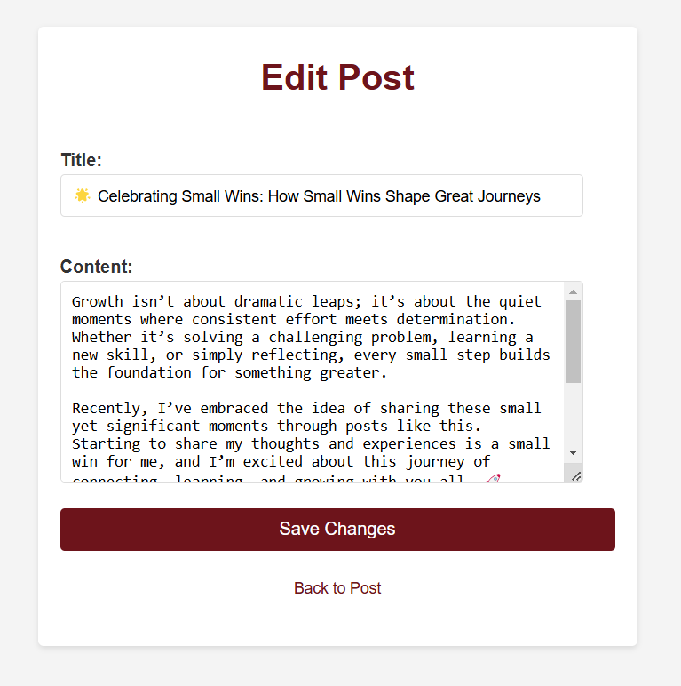

# Personal Blog Project with Django

## **Overview**
This is a simple personal blog application built with Django. Users can create, edit, and delete blog posts. The project is beginner-friendly and demonstrates core concepts of Django, including models, views, templates, forms, and URL routing.

---

## **Features**
- Add new blog posts.
- Edit existing posts.
- Delete posts.
- Display all posts in reverse chronological order.
- Basic styling for a clean and responsive design.

---

## **Prerequisites**
- Python (3.7 or higher) installed.
- Basic knowledge of Django and Python.
- Internet connection for installing dependencies.

---

## **Result**
- 
- 
- 
